# Smart Scroll

[](https://pub.dev/packages/smart_scroll)
[](https://pub.dev/packages/smart_scroll/score)
[](https://opensource.org/licenses/MIT)

📦 **pub.dev:** [https://pub.dev/packages/smart_scroll](https://pub.dev/packages/smart_scroll)

A powerful Flutter widget for **pull-to-refresh** and **infinite scroll** (load more / pagination).
Works seamlessly with `ListView`, `GridView`, `CustomScrollView`, and any scrollable widget.

Reuse flutter_pulltorefresh by peng8350, due to issue related to updating version dart.

## ✨ Features

- ↕️ **Pull down to refresh** & **pull up to load more**
- 🎨 **Multiple built-in indicators** — Material, Cupertino, WaterDrop, Bezier, Classic, Shimmer
- 🔄 **Platform-adaptive headers/footers** — `PlatformHeader` & `PlatformFooter` auto-detect iOS/Android
- 🛠️ **Custom indicator builder** — full control with `BuilderHeader` / `BuilderFooter`
- 🌐 **Horizontal & vertical** scrolling, including **reverse** scroll direction
- ⚙️ **Global configuration** via `RefreshConfiguration` (shared across all pages)
- 🌍 **Localization** support for indicator text
- 📱 Cross-platform: **iOS, Android, Web, Desktop**

## 📦 Installation

Add to your `pubspec.yaml`:

```yaml
dependencies:
  smart_scroll: ^1.0.2
```

Then run:

```bash
flutter pub get
```

## 🚀 Quick Start

```dart
import 'package:smart_scroll/smart_scroll.dart';

class MyPage extends StatefulWidget {
  @override
  State<MyPage> createState() => _MyPageState();
}

class _MyPageState extends State<MyPage> {
  final RefreshController _refreshController =
      RefreshController(initialRefresh: false);
  List<String> items = List.generate(10, (i) => 'Item ${i + 1}');

  void _onRefresh() async {
    await Future.delayed(const Duration(seconds: 1));
    _refreshController.refreshCompleted();
  }

  void _onLoading() async {
    await Future.delayed(const Duration(seconds: 1));
    setState(() {
      items.add('Item ${items.length + 1}');
    });
    _refreshController.loadComplete();
  }

  @override
  Widget build(BuildContext context) {
    return Scaffold(
      body: SmartScroll(
        enablePullDown: true,
        enablePullUp: true,
        header: const WaterDropHeader(),
        controller: _refreshController,
        onRefresh: _onRefresh,
        onLoading: _onLoading,
        child: ListView.builder(
          itemCount: items.length,
          itemBuilder: (context, index) => ListTile(title: Text(items[index])),
        ),
      ),
    );
  }
}
```

## 🎨 Built-in Indicators

### Refresh Headers

| Classic | WaterDrop | Material |
|:---:|:---:|:---:|
| 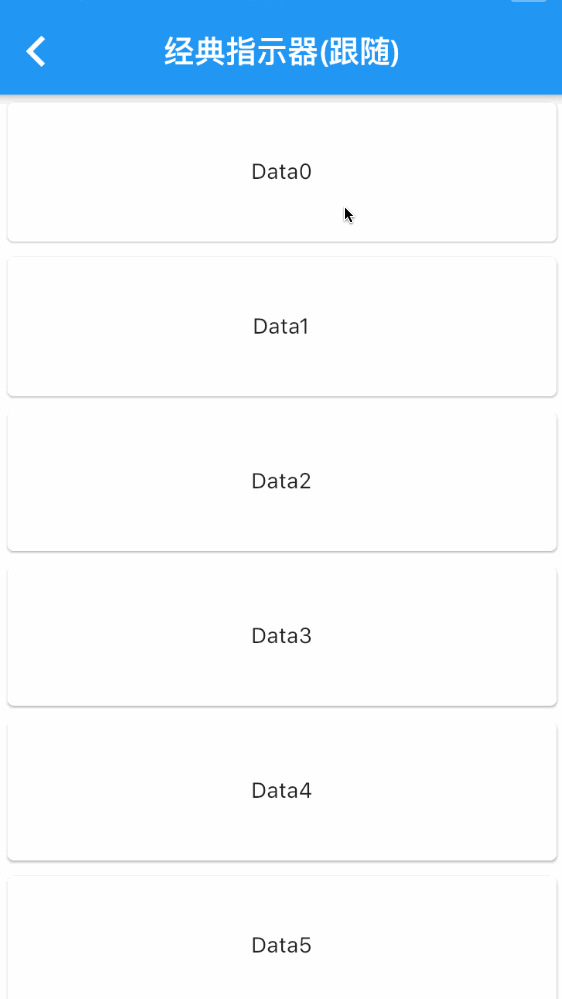 | 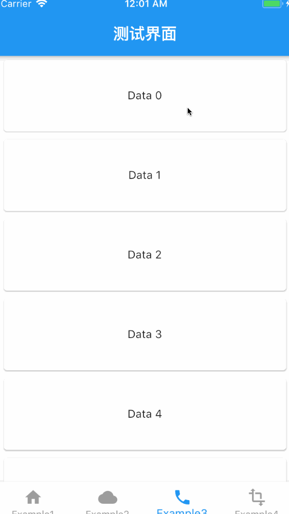 | 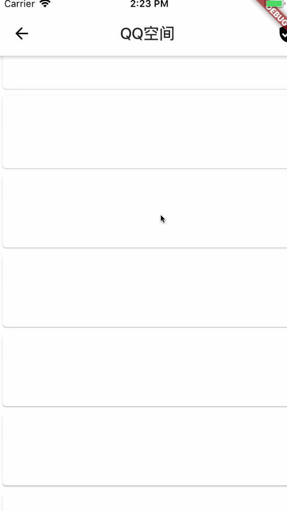 |

| Material WaterDrop | Shimmer | Bezier + Circle |
|:---:|:---:|:---:|
| 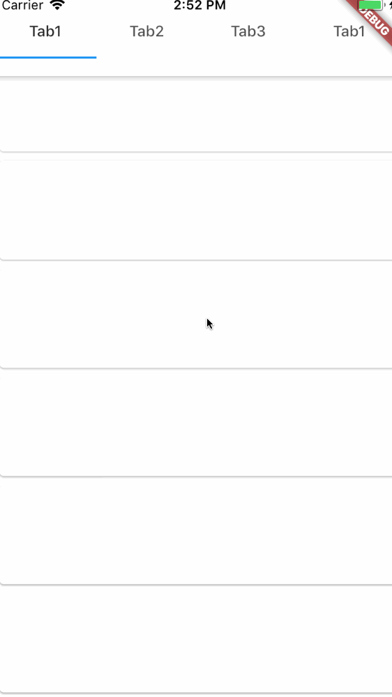 | 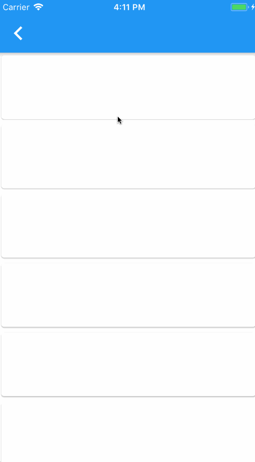 | 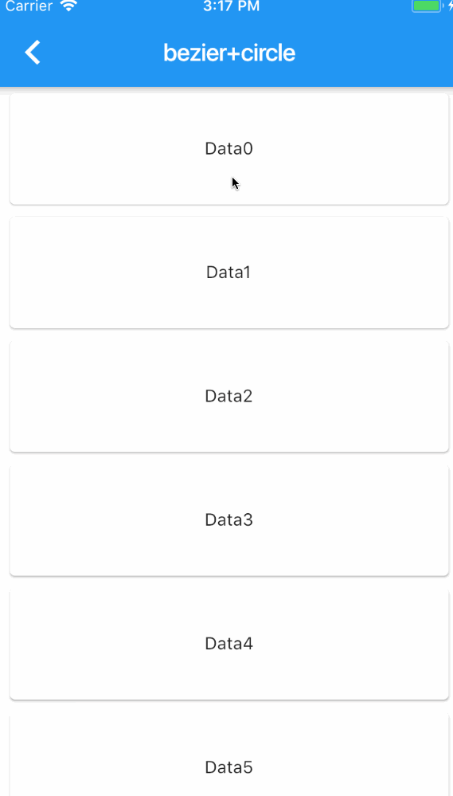 |

### Refresh Styles

| RefreshStyle.Follow | RefreshStyle.UnFollow | RefreshStyle.Behind | RefreshStyle.Front |
|:---:|:---:|:---:|:---:|
| 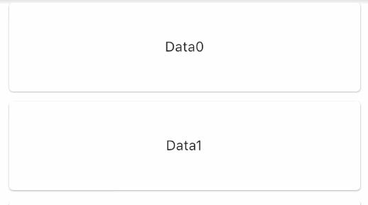 |  |  |  |

### Load More Styles

| LoadStyle.ShowAlways | LoadStyle.HideAlways | LoadStyle.ShowWhenLoading |
|:---:|:---:|:---:|
| 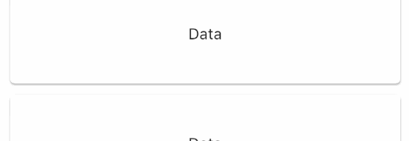 | 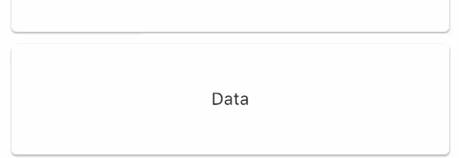 |  |

## 📸 Examples

| Basic | Link Header | Reverse + Horizontal |
|:---:|:---:|:---:|
| 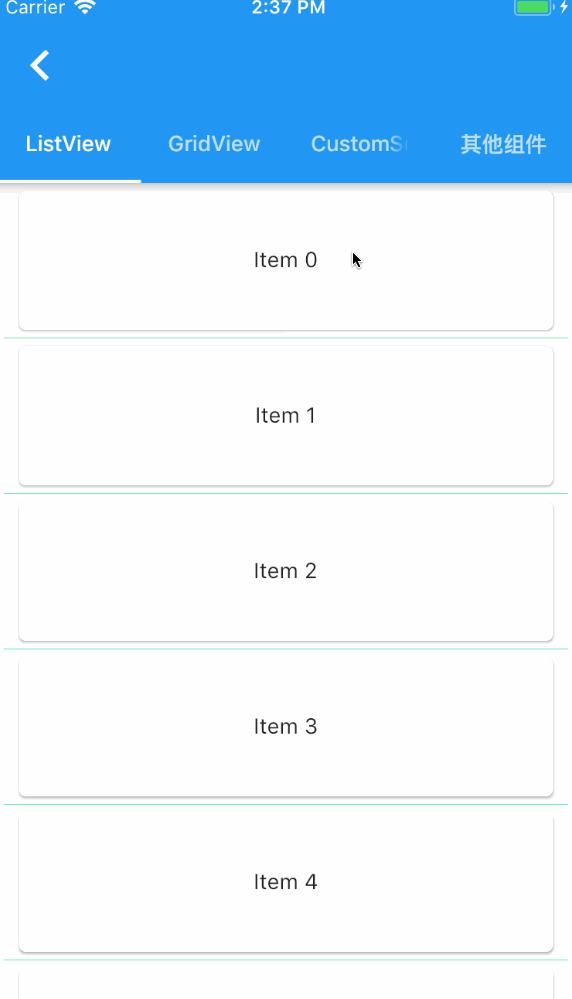 | 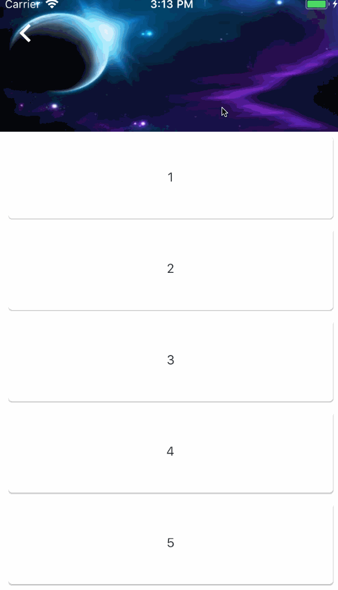 | 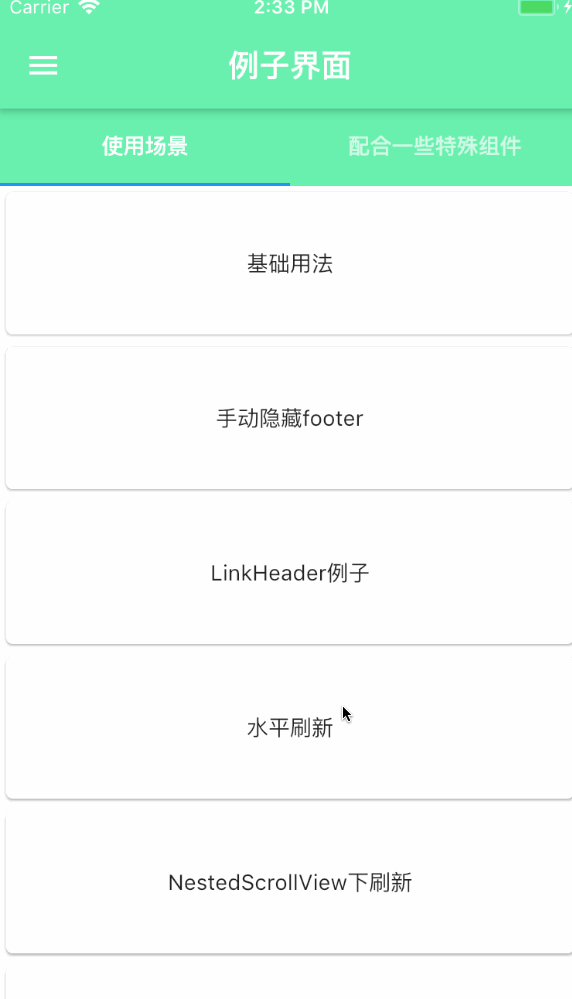 |

| Two Level | Other Widgets | Chat List |
|:---:|:---:|:---:|
| 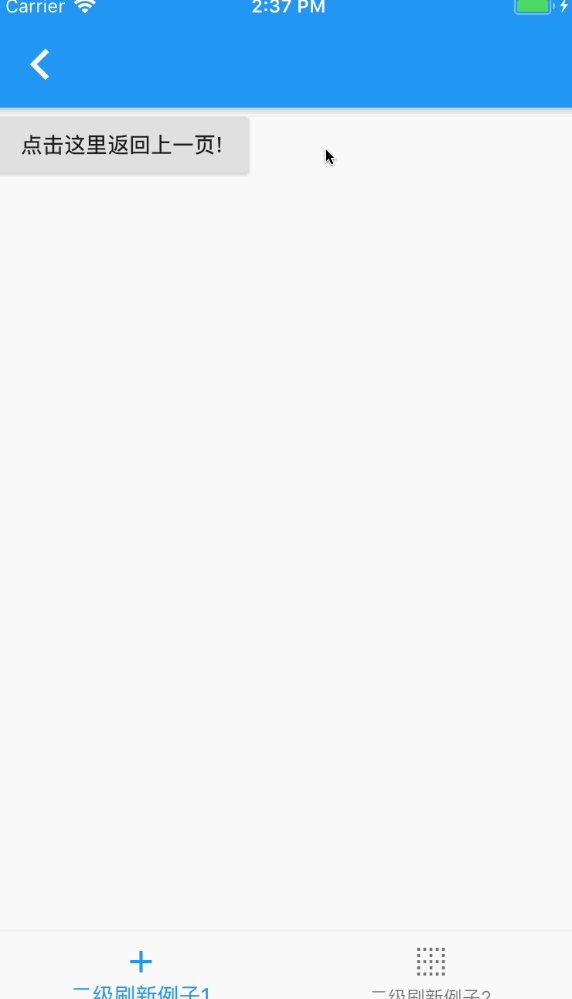 | 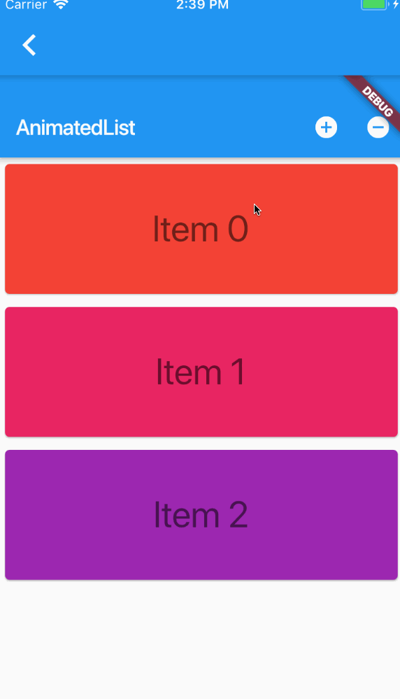 | 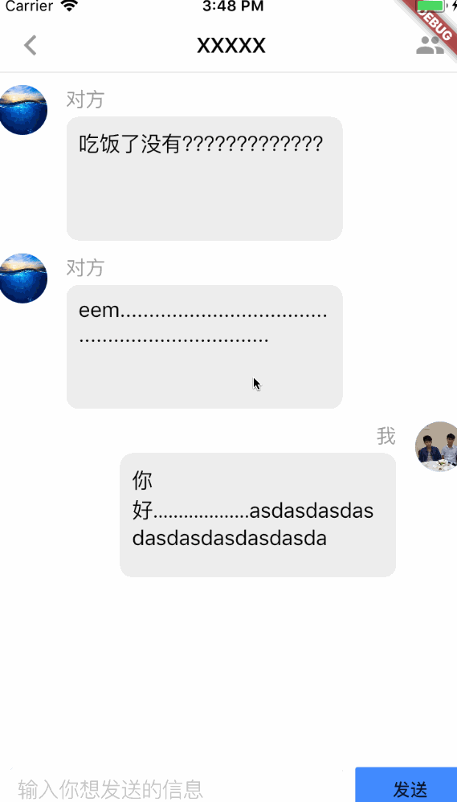 |

| Custom Header (SpinKit) | DraggableSheet + LoadMore | GIF Indicator |
|:---:|:---:|:---:|
| 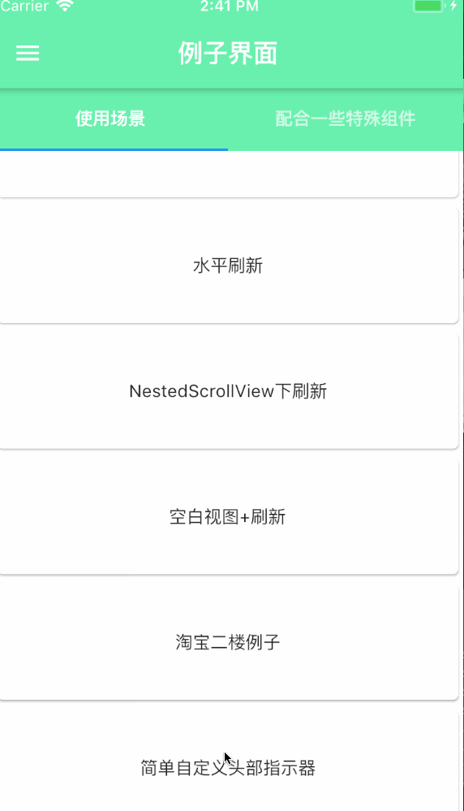 | 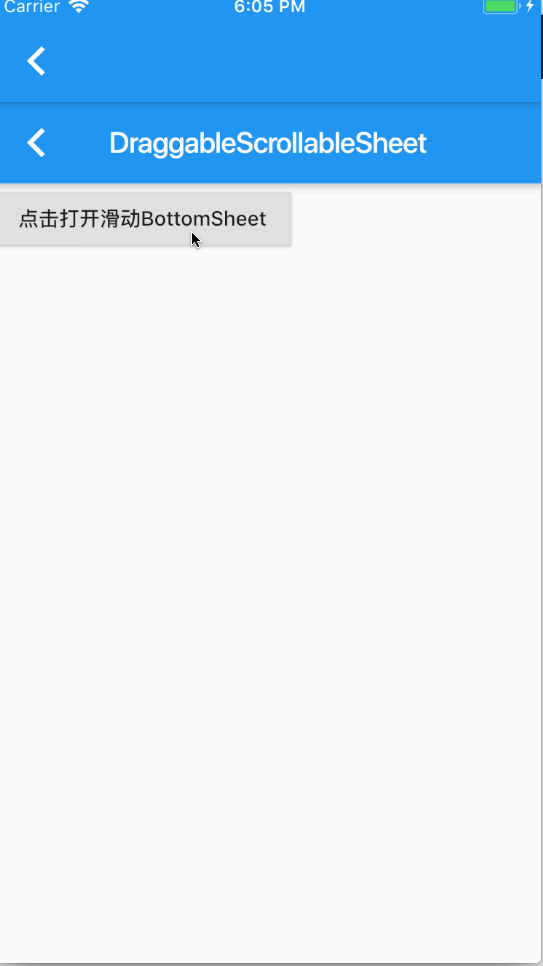 | 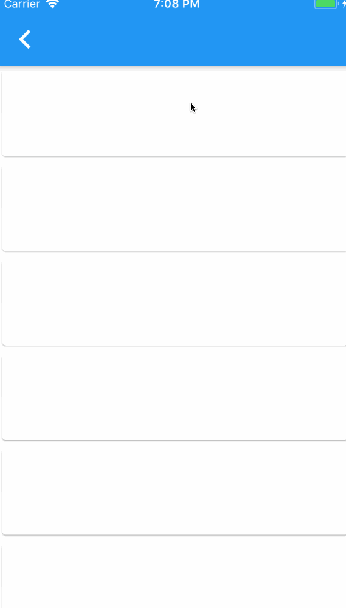 |

## ⚙️ Global Configuration

Use `RefreshConfiguration` at the root of your app to set defaults for all `SmartScroll` widgets:

```dart
RefreshConfiguration(
  headerBuilder: () => const WaterDropHeader(),
  footerBuilder: () => const ClassicFooter(),
  headerTriggerDistance: 80.0,
  maxOverScrollExtent: 100,
  maxUnderScrollExtent: 0,
  enableScrollWhenRefreshCompleted: true,
  enableLoadingWhenFailed: true,
  hideFooterWhenNotFull: false,
  enableBallisticLoad: true,
  child: MaterialApp(
    // ...
  ),
);
```

## 🛠️ Custom Indicator (Builder API)

Build fully custom refresh/load indicators using `BuilderHeader` and `BuilderFooter`:

```dart
SmartScroll(
  header: BuilderHeader(
    builder: (context, data) {
      return Container(
        height: 60,
        alignment: Alignment.center,
        child: Text(
          data.triggered ? 'Release to refresh' : 'Pull down...',
          style: TextStyle(
            color: Colors.grey,
            fontSize: 14,
          ),
        ),
      );
    },
  ),
  // ...
);
```

## 🌍 Localization

```dart
MaterialApp(
  localizationsDelegates: [
    RefreshLocalizations.delegate,
    GlobalWidgetsLocalizations.delegate,
    GlobalMaterialLocalizations.delegate,
  ],
  supportedLocales: const [
    Locale('en'),
    Locale('zh'),
  ],
);
```

## ⚠️ Important: Child Widget Rules

`SmartScroll` works best when its `child` is a **direct** `ScrollView` (`ListView`, `GridView`, `CustomScrollView`).

```dart
// ✅ Correct
ScrollBar(
  child: SmartScroll(
    child: ListView(...),
  ),
)

// ❌ Wrong — don't wrap ScrollView before passing to SmartScroll
SmartScroll(
  child: ScrollBar(
    child: ListView(...),
  ),
)
```

```dart
// ❌ Wrong — don't hide ScrollView inside another widget
SmartScroll(
  child: MyCustomWidget(), // contains ListView internally
)
```

## 📋 API Reference

### SmartScroll Properties

| Property | Type | Description |
|---|---|---|
| `child` | `Widget` | The scrollable content (ListView, GridView, etc.) |
| `controller` | `RefreshController` | Controls refresh/load state |
| `header` | `Widget?` | Custom refresh header indicator |
| `footer` | `Widget?` | Custom load-more footer indicator |
| `enablePullDown` | `bool` | Enable pull-down-to-refresh (default: `true`) |
| `enablePullUp` | `bool` | Enable pull-up-to-load-more (default: `false`) |
| `onRefresh` | `VoidCallback?` | Called when pull-down refresh is triggered |
| `onLoading` | `VoidCallback?` | Called when pull-up load-more is triggered |

### RefreshController Methods

| Method | Description |
|---|---|
| `refreshCompleted()` | Notify refresh is done |
| `refreshFailed()` | Notify refresh failed |
| `loadComplete()` | Notify load-more is done |
| `loadFailed()` | Notify load-more failed |
| `loadNoData()` | Notify no more data to load |
| `resetNoData()` | Reset no-data state |

## 🐛 Known Issues

- **NestedScrollView**: Quick scroll direction changes may cause bounce-back due to Flutter's
  `BouncingScrollPhysics` handling. Related Flutter issues: [#34316](https://github.com/flutter/flutter/issues/34316), [#33367](https://github.com/flutter/flutter/issues/33367), [#29264](https://github.com/flutter/flutter/issues/29264).
- **AnimatedList / ReorderableListView**: Not directly supported as `child`. Use `SliverAnimatedList` inside a `CustomScrollView` instead.

## 🙏 Credits

- Inspired by [flutter_pulltorefresh](https://github.com/peng8350/flutter_pulltorefresh) by [peng8350](https://github.com/peng8350)
- [SmartRefreshLayout](https://github.com/scwang90/SmartRefreshLayout) (Android)

## 📄 License

MIT License — see [LICENSE](LICENSE) for details.